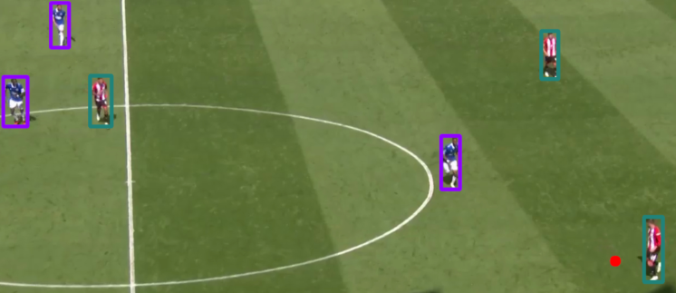

# Football player detector
Software capable of analyzing video files of football matches. The end goal is to detect players (distinguishing teams) and referees, and locate the football ball itself.
## Features

### Player and ball detection
Based on YOLO-9's "person" and "sports ball" classes.

### Team recognition
1. Each player's bounding box is cropped 
2. The green color from the background removed with a color filter in HSV space
3. The most prevalent color in their uniform is extracted in HSV
4. Players with colors too close to black are classified as referees
5. The remaining colors are used to train a KNN model with 2 classes, which then classifies each player in one team or the other
6. The bounding box square of each player is drawn with the cluster center of its player's class
7. Referees' bounding box squares are drawn in black

## Running
1. Create and source a python environment:
`python3 -m venv .venv`
`source .venv/bin/activate`
2. Run the process_video.py script, optionally changing the video and json's output paths:
`python3 process_video.py <input video path> --video_output_path <new video output path> --json_output_path <new json output path>`
